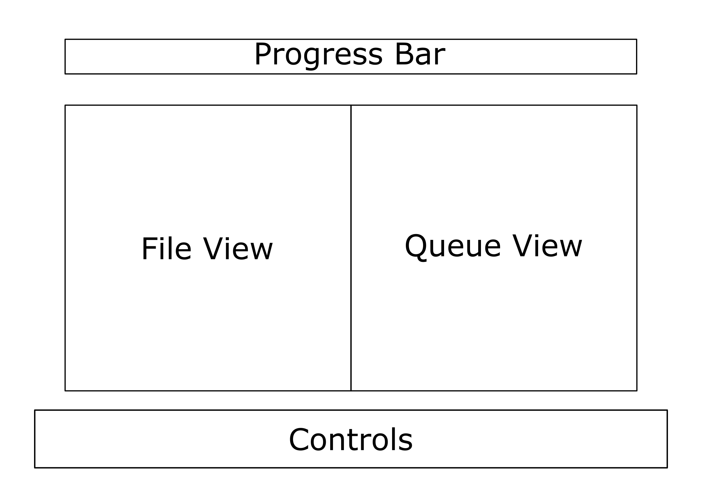

# StickyFingers

A command line file archiving tool. 

# Team

Members: Tahsin, Taysen, and Tazer\
Pd: 10

# Description 

## Background 

In most modern computers file archiving and compression are necessary. Unix accomplishes this in two steps. First a program called `tar` concatenates these files into one, which another program, either `gzip` or `bzip2`, compress using algorithms that usually look at word frequencies. Our program focuses on the former, because compression is hard and beyond the scope of this class.  
\
The way `tar` works is rather simple. It divides files into 512 byte blocks. Each file in the archive has a preceding header block, as specified by the **ustar** standard, and extra spaces are filled with NULL characters. The last block is also just NULL characters. More information about `tar` can be found [here](https://en.wikipedia.org/wiki/Tar_(computing)).  
\
Our program will implement the `tar` archiving algorithm as well as provide a UI to easily archive and extract files. There will also be a priority queue, so that users can either prioritize bigger or smaller files first.    

## User Interface

1. Progress Bar: progress on current item and information on queued items
2. File View: chose and view the contents of files
3. Queue View: view and edit queue items
4. Controls: quick reference of commands

## Systems Concepts

1. Allocating Memory: items in priority queue will have to dynamically allocated
2. Working with files: files are read from and written to in chuncks
3. File information: file metadata is used to create the tarball and some information will be displayed in the file view
4. Process: a background process will create the tarball, so the user can continue making and editing tars
5. Signals: `Ctrl+C` will be overwritten to ask the user if they wish to discard the current item
6. Shared Memory: the main process will add to the priority queue, while the background process will remove them as it finishes with them

## Timeline

1. Implement taring algorithm (2-3 days)
2. Implement priority queue (1 day)
3. Create UI interface (3 days)
    - Select files from file view (1 day)
    - Edit items in queue view (1 day)
    - Progress bar and signals (1 day)
5. Finish README (1-2 hrs)

## Libraries 

* ncurses: used to create a command line interface. 
  
Mac/OSX:
> brew install ncurses

Debian/Ubuntu: 
> sudo apt-get install libncurses-dev

Arch/Manjaro: 
> sudo pacman -Syu ncurses

# How to Use
